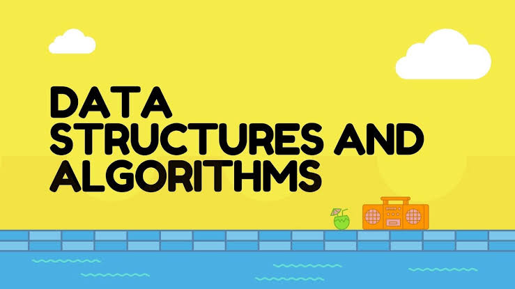

## 🚀 My DSA Journey | #RoadToSDE

Welcome to my **Data Structures & Algorithms (DSA) Journey** repository!  
This repo serves as my personal tracker for solving DSA problems and refining my problem-solving skills.

The goal is to **consistently practice, optimize solutions, and master DSA concepts** to prepare for **coding interviews**.

## 📜 Blind 75 DSA Questions

### 1️⃣ Arrays & Hashing

- [ ] 🟢 **Contains Duplicate** (Easy) – `LeetCode 217`
- [ ] 🟠 **Valid Anagram** (Easy) – `LeetCode 242`
- [ ] 🔴 **Two Sum** (Easy) – `LeetCode 1`
- [ ] 🟠 **Group Anagrams** (Medium) – `LeetCode 49`
- [ ] 🟠 **Top K Frequent Elements** (Medium) – `LeetCode 347`
- [ ] 🔴 **Product of Array Except Self** (Medium) – `LeetCode 238`
- [ ] 🔴 **Valid Sudoku** (Medium) – `LeetCode 36`
- [ ] 🔴 **Encode and Decode Strings** (Medium) – `LeetCode 271`

### 2️⃣ Two Pointers

- [ ] 🔴 **Valid Palindrome** (Easy) – `LeetCode 125`
- [ ] 🔴 **Two Sum II - Input Array Is Sorted** (Medium) – `LeetCode 167`
- [ ] 🔴 **3Sum** (Medium) – `LeetCode 15`
- [ ] 🔴 **Container With Most Water** (Medium) – `LeetCode 11`
- [ ] 🔴 **Trapping Rain Water** (Hard) – `LeetCode 42`

### 3️⃣ Sliding Window

- [ ] 🔴 **Best Time to Buy and Sell Stock** (Easy) – `LeetCode 121`
- [ ] 🔴 **Longest Substring Without Repeating Characters** (Medium) – `LeetCode 3`
- [ ] 🔴 **Longest Repeating Character Replacement** (Medium) – `LeetCode 424`
- [ ] 🔴 **Permutation in String** (Medium) – `LeetCode 567`
- [ ] 🔴 **Minimum Window Substring** (Hard) – `LeetCode 76`

### 4️⃣ Stack

- [ ] 🔴 **Valid Parentheses** (Easy) – `LeetCode 20`
- [ ] 🔴 **Min Stack** (Medium) – `LeetCode 155`
- [ ] 🔴 **Evaluate Reverse Polish Notation** (Medium) – `LeetCode 150`
- [ ] 🔴 **Generate Parentheses** (Medium) – `LeetCode 22`
- [ ] 🔴 **Daily Temperatures** (Medium) – `LeetCode 739`
- [ ] 🔴 **Car Fleet** (Medium) – `LeetCode 853`
- [ ] 🔴 **Largest Rectangle in Histogram** (Hard) – `LeetCode 84`

### 5️⃣ Binary Search

- [ ] 🔴 **Binary Search** (Easy) – `LeetCode 704`
- [ ] 🔴 **Search in Rotated Sorted Array** (Medium) – `LeetCode 33`
- [ ] 🔴 **Find Minimum in Rotated Sorted Array** (Medium) – `LeetCode 153`
- [ ] 🔴 **Koko Eating Bananas** (Medium) – `LeetCode 875`
- [ ] 🔴 **Median of Two Sorted Arrays** (Hard) – `LeetCode 4`

### 6️⃣ Linked List

- [ ] 🔴 **Reverse a Linked List** (Easy) – `LeetCode 206`
- [ ] 🔴 **Merge Two Sorted Lists** (Easy) – `LeetCode 21`
- [ ] 🔴 **Reorder List** (Medium) – `LeetCode 143`
- [ ] 🔴 **Remove Nth Node from End of List** (Medium) – `LeetCode 19`
- [ ] 🔴 **Copy List with Random Pointer** (Medium) – `LeetCode 138`
- [ ] 🔴 **Linked List Cycle** (Easy) – `LeetCode 141`
- [ ] 🔴 **Find the Duplicate Number** (Medium) – `LeetCode 287`

### 7️⃣ Trees

- [ ] 🔴 **Invert Binary Tree** (Easy) – `LeetCode 226`
- [ ] 🔴 **Maximum Depth of Binary Tree** (Easy) – `LeetCode 104`
- [ ] 🔴 **Same Tree** (Easy) – `LeetCode 100`
- [ ] 🔴 **Subtree of Another Tree** (Easy) – `LeetCode 572`
- [ ] 🔴 **Lowest Common Ancestor of a BST** (Medium) – `LeetCode 235`
- [ ] 🔴 **Binary Tree Level Order Traversal** (Medium) – `LeetCode 102`
- [ ] 🔴 **Serialize and Deserialize Binary Tree** (Hard) – `LeetCode 297`

### 8️⃣ Graphs

- [ ] 🔴 **Number of Islands** (Medium) – `LeetCode 200`
- [ ] 🔴 **Clone Graph** (Medium) – `LeetCode 133`
- [ ] 🔴 **Pacific Atlantic Water Flow** (Medium) – `LeetCode 417`
- [ ] 🔴 **Course Schedule** (Medium) – `LeetCode 207`
- [ ] 🔴 **Network Delay Time** (Medium) – `LeetCode 743`
- [ ] 🔴 **Word Ladder** (Hard) – `LeetCode 127`

### 9️⃣ Dynamic Programming

- [ ] 🔴 **Climbing Stairs** (Easy) – `LeetCode 70`
- [ ] 🔴 **House Robber** (Medium) – `LeetCode 198`
- [ ] 🔴 **Coin Change** (Medium) – `LeetCode 322`
- [ ] 🔴 **Longest Increasing Subsequence** (Medium) – `LeetCode 300`
- [ ] 🔴 **Longest Common Subsequence** (Medium) – `LeetCode 1143`
- [ ] 🔴 **Word Break** (Medium) – `LeetCode 139`

### 🔟 Bit Manipulation

- [ ] 🔴 **Single Number** (Easy) – `LeetCode 136`
- [ ] 🔴 **Number of 1 Bits** (Easy) – `LeetCode 191`
- [ ] 🔴 **Counting Bits** (Easy) – `LeetCode 338`
- [ ] 🔴 **Reverse Bits** (Easy) – `LeetCode 190`

## 🎯 Goals

✔ Solve **All 75 Problems**  
✔ Master **Optimal Approaches**  
✔ Track Progress with ✅

## 🔥 Topics Covered

- ✅ Arrays
- ✅ Strings
- ✅ Linked Lists
- ✅ Stacks & Queues
- ✅ Trees & Graphs
- ✅ Sorting & Searching
- ✅ Dynamic Programming
- ✅ Greedy Algorithms
- ✅ Recursion & Backtracking
- ✅ Bit Manipulation

---

Thank you for your time! Happy Coding!
🌟 **Star this repo if you're also on the DSA journey!** ⭐
